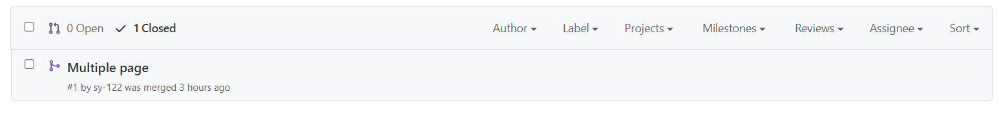

# COMP0034 Coursework 1  
This is Soyeong Bak's 2022/2023 COMP0034 Coursework 1.

(Student id: 19101957)

# Set-up instructions

1. You can git clone or download the repository through:
```
https://github.com/sy-122/comp0034-cw1-i-sy-122.git
```

2. Then you need an active virtual environment.
3. Install the requirements from [requirements.txt](requirements.txt)
4. Run the [dash_app.py](seoulbike_app/dash_app.py)
   (Every files needed for the app is in the seoulbike_app file)

# Visualisation design

Explanation of visualization : [Visualization Design.pdf](Visualization Design.pdf)


# Dash app

The app is for two different group of users (explained in the 'Visualisation design').
It is made, so it's not too complicated for the wide audience to use, but to be engaging 

The app is a multiple page app with two pages: 'Home' and 'Comments' pages. The 'Home' page has all the visualization. 
The 'Home' page has two tabs that divide the visualizations, the first one uses time related variables and the 
second tab uses other variables. There are different functions in each visualization that makes it very interactive and 
give the users more control over the app. An example would be that for the visualization in the second tab you can not 
only choose the x-variable but also add the number of displayed chart.

The 'Comment' page is a very simple page where it allows the users to write comment. The public is expected to use 
the app and that is a big group of very different and unique people. Hence, to be able to understand what they feel about 
the app a 'Comment' page was made to gather their comments or reviews of the app.  

*It can take time for the visualization, especially the scatter graph, to load so please be patient.*

### Tools and Techniques used for the app
Git was used to make the app with regular updates and appropriate commit messages. Initially, the purpose was not to 
make multiple page dash app but because I had some time left I decided to create one. I created a new branch called 'multiple_page' to work 
on the app with multiple pages so in case I don't finish it on time I will still have a working app to hand in. 
Fortunately, I was able to successfully create a multiple page app, so through the push request I merged it 
with my main branch. 

