# Coursework 2 portfolio

## Requirements definition and analysis
### Requirements identification methods
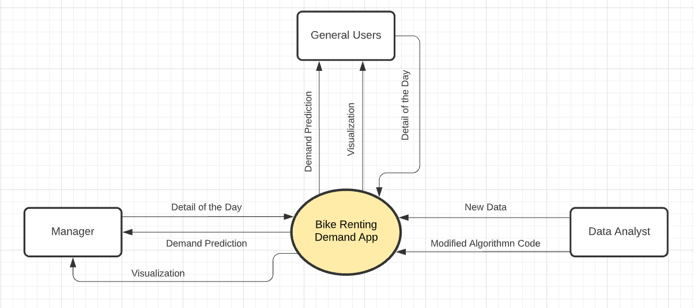

Figure 1. Bike Renting Demand App Context Diagram

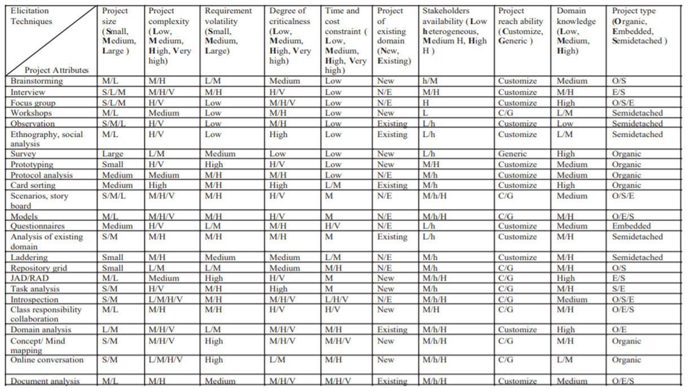

Figure 2. Elicitation Techniques matrix (source: Tiwari.S 2017)

Software requirement elicitation is one of the most fundamental and critical parts of software development life cycle, which
greatly effect the success of the project. 

In “A Methodology for the Selection of Requirement Elicitation Techniques”, Tiwari and Rathore made a project attributes matrix 
that shows the appropriate project attributes for each elicitation technique. (Figure 2) Since it was hard to choose one, with
the numerous techniques available I decided to use the matrix to find the one that suited best for the project.

The two most important attributes considered were whether the techniques are for new projects and how long it took.
There is a limited amount of time for our project, hence, choosing a time-consuming technique would be problematic. 
With those two attributes in mind and the complexity of the project, I was able to exclude a lot of techniques from my possible options. 

Then looking back at the context diagram (Figure 1), made previously, we can know that there are three different stakeholders in the project. 
The stakeholders interact with the software a bit differently, but at the same time, their interaction with the app affects each other. 
Workshops were chosen as the elicitation techniques, as not only is it a way to elicit detailed REQ in a short period, 
but workshops also provide a collaborative environment for stakeholders to make decisions and make immediate feedback available. 
Indentified stakeholders would be willing to participate and provide insights as it is something that matters to them and 
benefit them so we wouldn't have the problem of finding stakeholders and be able to indentify the needs of each of them.

### Requirement specification method
The user story is the method used to identify the requirements for the web app. 
User stories are centered on the result and the values the system can create for each user.
While use cases are better in giving more comprehensive and detailed requirements, 
there is heavy “upfront investment in documentation needed”, which can “make the process less ‘agile’”. (Janes, 2021)
Furthermore, as user story are designed to be simple, it will help spare the team and the stakeholders, such as the bike
manager team who, from trying to understand a lot of technical lingo.

The functional and non-functional requirements weren’t written separately. Most user case stories had functional and 
non-functional requirements; hence it didn’t seem too necessary to write them separately but included in the acceptance criteria.  

### Prioritisation method
MoSCoW method has been chosen to priorities requirements as it is a good agile method that helps the team to understand 
which requirements or tasks to focus on. With three different customers identified for the app, the team got ambitious, 
and certain user stories that aren’t really the focus of the app were brainstormed and added. While additional functions
can be good to meet different needs, it would make the project too complex and lengthen the time that is required to finish
the project. MoSCoW method will help the team focus on the most important task and get the main components of the project 
finished quickly and by deciding that requirements aren’t needed it will also cut out unnecessary things and “keep things lean,
agile and simple”. (Buehring, 2021) Yet, at the same time with the ‘should’ and ‘could’, the team is able to make more pleasant 
products for the end-users. 

Using MoSCoW technique the user stories are given different levels of prioritization. Since the main goal of this app is
to forecast the demand, user stories that are more relevant and related to reaching this goal have been given more 
importance. 

### Documented and prioritised requirements
Link to the full list of documented and prioritised requirements: 
https://github.com/ucl-comp0035/coursework-2-optional-sy-122/blob/e482b530f642214331ea574320b405ae3f52d28b/Requirements.pdf 

Requirements_Doc.pdf 

## Design
### Structure and flow of the interface
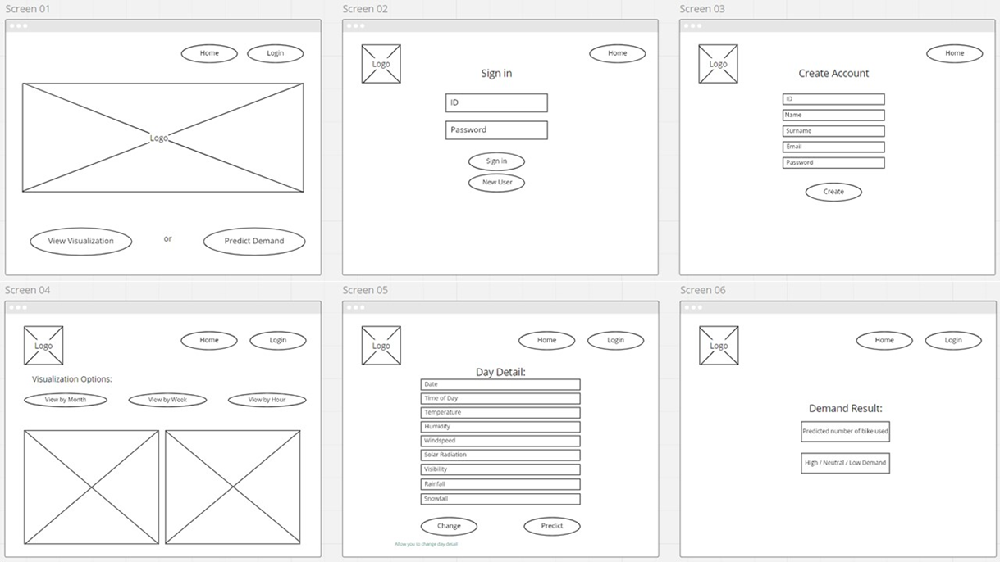
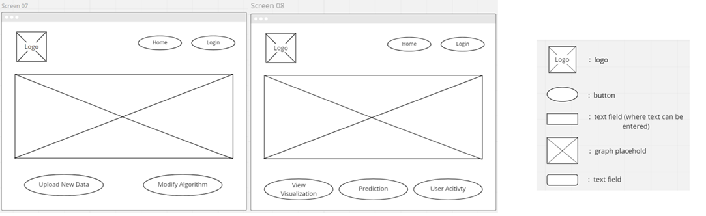
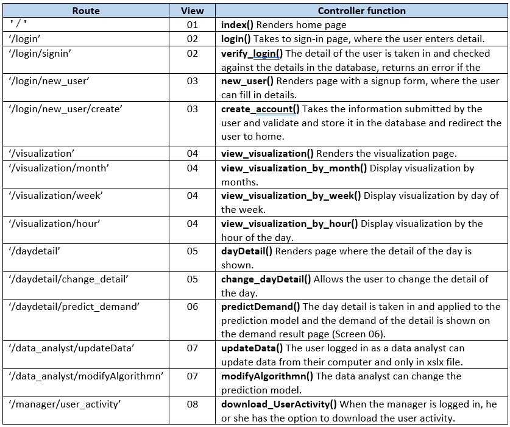

### Application structure
UML CLASS Design
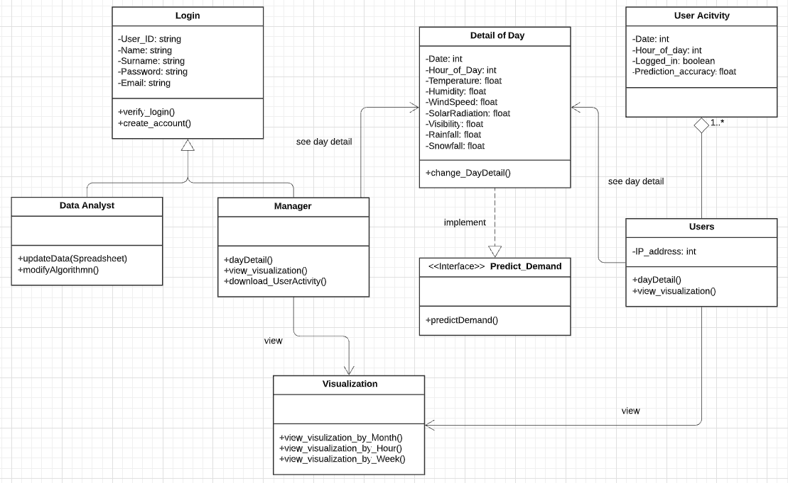

### Relational database design
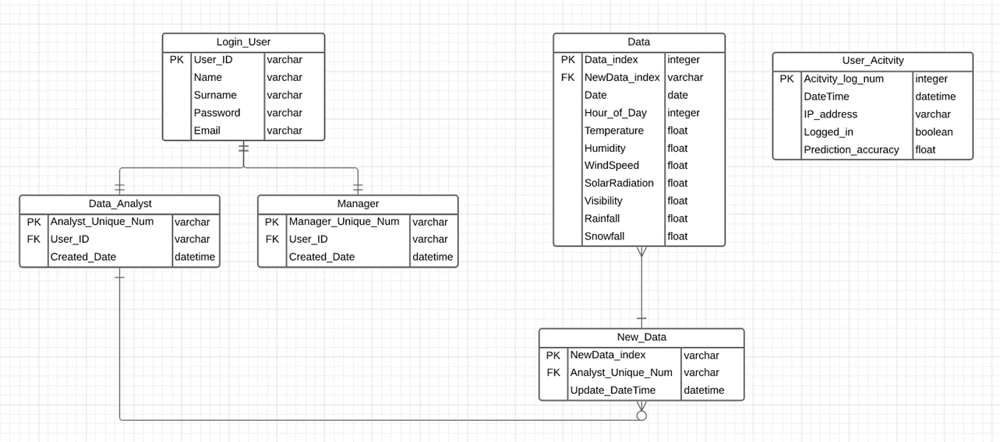
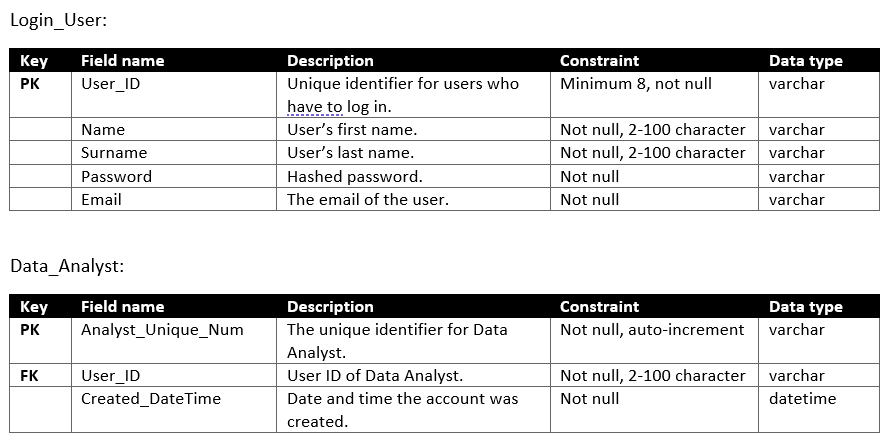
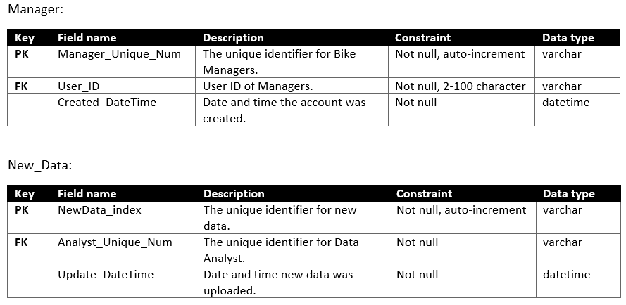
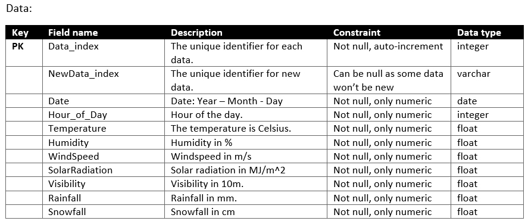
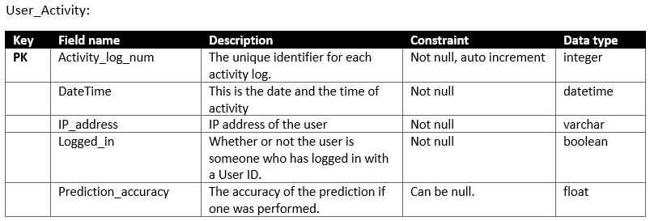

## Testing
### Choice of unit testing library
Standard python test libraries are Unittest and Pytest. I have decided to use Pytest because Pytest is simpler. Pytest 
supports the plain ‘assert’ statement, has less boilerplate code making it is more suitable for reading, and helps 
simplify setting up and tearing down the test state. On the other hand, when using an Unittest one would have to import
modules and it is mandatory to create a class and define the testing functions within that class as it won’t allow using 
functions for test cases. But most importantly, Flask would be used for developing the software and usually, Pytest is 
used for Flask.

### Tests
The test are put in the test directory. Three tests were written for the User function in user.py.

### Test results
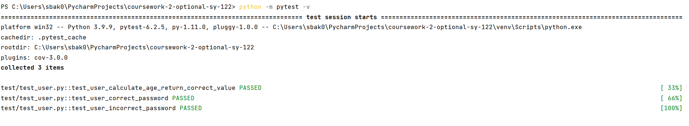

Coverage and more detailed report: 

### Continuous integration (optional)
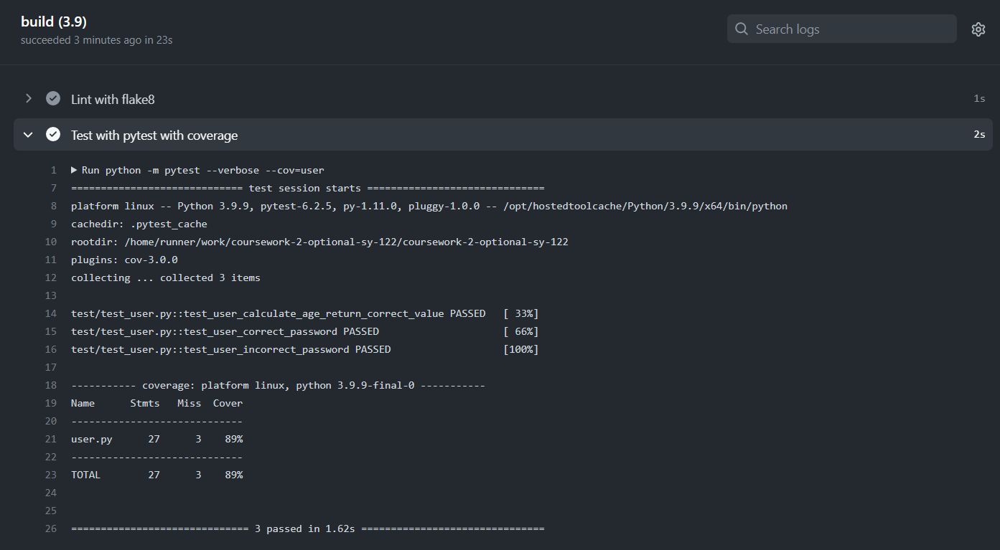

link to yml: 
https://github.com/ucl-comp0035/coursework-2-optional-sy-122/blob/8f6c08be9ee76464d82fd0e0e8b16c4858cb6796/.github/workflows/test_cov.yml

## Weekly progress reports

### Report 1
What I did in the last week:

- I created a context diagram that helped me re-think how my software app would be used by different people.
- I looked over the different elicitation techniques. While I did have a hard time choosing I was able to pick one that I 
thought suited best for my project and write the reasons behind why I have chosen a specific technique.
- I started to specify the requirement but was only able to do very few.

What I plan to do in the next week:

- I plan to think more about the requirement as I feel like I need more brainstorming about the different scenarios.
- I plan to put more time into brainstorming my requirements and it needs more work. 

Issues blocking my progress (state ‘None’ if there are no issues):

- I have an idea of how I want my software app to be like, but I am not sure if it's a good idea to have it like that. 
### Report 2
What I did in the last week:

- have finished the user story I was working on last week.
-I also drew how I want my interface to look like for the users. 

What I plan to do in the next week:

- I plan to finish the interface design with the identifying models and routes.
- I also have a feeling that I might make more changes for my use case. 

Issues blocking my progress (state ‘None’ if there are no issues):

- I am kind of confused if I am on the right track and I am kind of confused about what exactly are the things we need 
to identify for it. 

### Report 3
What I did in the last week:

- have finished UML class diagram.
- I have also done the database conceptual and logical design and did a database schema for two of my tables. 

What I plan to do in the next week:

- I plan to finish my database schema and think about the code quality.

Issues blocking my progress (state ‘None’ if there are no issues):

- I am still unsure if I did my Class diagram right and am also a bit confused about the database diagram.

### Report 4
What I did in the last week:

- I have started testing. 

What I plan to do in the next week:

- I plan on doing the extra bit on testing.
- I plan to edit some of the things I have done previously.

Issues blocking my progress (state ‘None’ if there are no issues):

- There are a few things I am still confused about with my database diagram, which I would like to ask in the tutoring 
session.

## References
Buehring, S., 2021. MoSCoW Prioritisation | MoSCoW Analysis | MoSCoW Method | MoSCoW Project Management | MoSCoW Technique | 
MoSCoW Agile | MoSCoW Priority. [online] Knowledge Train. Available at: <https://www.knowledgetrain.co.uk/agile/moscow-prioritisation> 
[Accessed 26 July 2021].

Kennedy, P., 2021. Testing Flask Applications with Pytest. [online] Testdriven.io. Available at: <https://testdriven.io/blog/flask-pytest/> 
[Accessed 5 December 2021].

Python Pool. 2021. Python Unittest Vs Pytest: Choose the Best. [online] Available at: <https://www.pythonpool.com/python-unittest-vs-pytest/> 
[Accessed 28 November 2021].

Tiwari, Saurabh & Rathore, Santosh. (2017). A Methodology for the Selection of Requirement Elicitation Techniques. 
[Accessed October 27]

